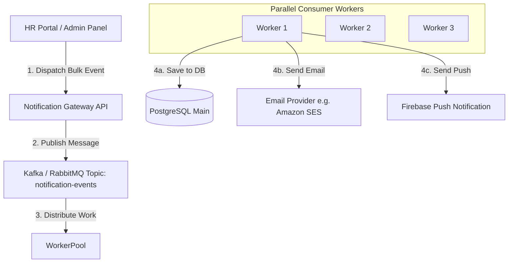

# Campus Notification System - System Design Document

This document covers the complete backend system design for the Campus Notification Microservice, divided into 5 critical stages.

---

## STAGE 1: API Design (Contract Specification)

To allow the frontend to integrate smoothly, we define the following API endpoints. All requests must include standard security headers.

### Common Headers
- `Authorization: Bearer <JWT_TOKEN>` (Mandatory for all authenticated endpoints)
- `Content-Type: application/json`
- `Accept: application/json`

---

### 1. GET `/notifications`
Fetches a list of notifications for the authenticated student. Supports pagination and filtering.

- **Query Parameters**:
  - `page` (optional, default: 1): Page number
  - `limit` (optional, default: 10): Number of notifications per page
  - `type` (optional): Filter by type (`Placement`, `Result`, `Event`)
  - `isRead` (optional): Filter read/unread status (`true`, `false`)

- **Response (200 OK)**:
```json
{
  "success": true,
  "data": {
    "notifications": [
      {
        "id": "bfef9a08-6486-4d6a-ae0e-3714d1d6164b",
        "type": "Placement",
        "message": "Google is hiring for SDE-1 roles! Apply by June 30.",
        "timestamp": "2026-06-25T10:56:04.000Z",
        "isRead": false
      },
      {
        "id": "638a521b-6615-4f06-b820-6e22c8a224ce",
        "type": "Result",
        "message": "Mid-Semester exam results are out now.",
        "timestamp": "2026-06-25T21:25:55.000Z",
        "isRead": true
      }
    ],
    "pagination": {
      "currentPage": 1,
      "totalPages": 5,
      "totalItems": 48,
      "hasNextPage": true
    }
  }
}
```

---

### 2. POST `/notifications`
Exposed to administrative services (e.g., Placement Cell portal, Exam cell) to dispatch notifications.

- **Request Body**:
```json
{
  "studentId": "8f850f9d-3873-4093-bc27-2da500fd9bcb",
  "type": "Placement",
  "message": "Microsoft has opened applications for off-campus internships.",
  "priority": "High"
}
```

- **Response (201 Created)**:
```json
{
  "success": true,
  "message": "Notification dispatched successfully",
  "data": {
    "id": "778a521b-6615-4f06-b820-6e22c8a224cf",
    "studentId": "8f850f9d-3873-4093-bc27-2da500fd9bcb",
    "type": "Placement",
    "message": "Microsoft has opened applications for off-campus internships.",
    "isRead": false,
    "createdAt": "2026-06-26T12:28:00.000Z"
  }
}
```

---

### 3. PATCH `/notifications/:id/read`
Marks a single notification as read.

- **Response (200 OK)**:
```json
{
  "success": true,
  "message": "Notification marked as read"
}
```

---

### 4. DELETE `/notifications/:id`
Deletes/removes a notification from the student's view.

- **Response (200 OK)**:
```json
{
  "success": true,
  "message": "Notification deleted successfully"
}
```

---

### 5. GET `/notifications/unread-count`
Retrieves the total count of unread notifications for badge counts.

- **Response (200 OK)**:
```json
{
  "success": true,
  "data": {
    "unreadCount": 12
  }
}
```

---

### 6. GET `/notifications/priority-inbox`
Retrieves the student's high-priority inbox where notifications are sorted by:
1. Category Importance: `Placement` (High) > `Result` (Medium) > `Event` (Low)
2. Recency: Newer notifications are shown first.

- **Response (200 OK)**:
```json
{
  "success": true,
  "data": {
    "notifications": [
      {
        "id": "placement-123",
        "type": "Placement",
        "message": "Google Hiring SDE-1",
        "timestamp": "2026-06-26T10:00:00.000Z",
        "isRead": false
      },
      {
        "id": "result-456",
        "type": "Result",
        "message": "Mid Sem Result Declared",
        "timestamp": "2026-06-26T12:00:00.000Z",
        "isRead": false
      },
      {
        "id": "event-789",
        "type": "Event",
        "message": "Annual Hackathon Registrations Open",
        "timestamp": "2026-06-26T09:00:00.000Z",
        "isRead": false
      }
    ]
  }
}
```

---

## STAGE 2: Database Storage Choice & Schema

### Database Choice: PostgreSQL (Relational Database)

For storing notification data, we choose a Relational DB like **PostgreSQL** over MongoDB or Redis for key reasons:
1. **Relational Integrity**: Notifications are inherently linked to students (using `student_id`). Relational DBs enforce foreign keys and reference integrity out-of-the-box.
2. **ACID Transactions**: Mark Read operations, bulk updates, and user modifications require strict transaction consistency.
3. **Structured Queries**: Sorting notifications by priority and timestamp requires efficient index-based composite scans. Relational databases excel at this.
4. *Note on Redis*: Redis is extremely fast but is volatile/expensive for permanent storage of millions of historical notifications. It will be used for caching instead of primary storage.

### Relational Schema Design

#### 1. `students` Table
Stores basic student records.
```sql
CREATE TABLE students (
    id UUID PRIMARY KEY DEFAULT gen_random_uuid(),
    name VARCHAR(100) NOT NULL,
    email VARCHAR(150) UNIQUE NOT NULL,
    roll_no VARCHAR(50) UNIQUE NOT NULL,
    created_at TIMESTAMP WITH TIME ZONE DEFAULT CURRENT_TIMESTAMP
);
```

#### 2. `notifications` Table
Stores the notifications.
```sql
CREATE TABLE notifications (
    id UUID PRIMARY KEY DEFAULT gen_random_uuid(),
    student_id UUID NOT NULL REFERENCES students(id) ON DELETE CASCADE,
    type VARCHAR(20) NOT NULL CHECK (type IN ('Placement', 'Result', 'Event')),
    message TEXT NOT NULL,
    is_read BOOLEAN NOT NULL DEFAULT FALSE,
    created_at TIMESTAMP WITH TIME ZONE DEFAULT CURRENT_TIMESTAMP,
    read_at TIMESTAMP WITH TIME ZONE NULL
);
```

### Indexes
1. **Primary Key Indexes**: Automatically created on `students(id)` and `notifications(id)`.
2. **Composite Index for Queries**:
   ```sql
   CREATE INDEX idx_student_unread_created ON notifications (student_id, is_read, created_at DESC);
   ```
   *Explanation*: This composite index directly satisfies queries fetching unread notifications for a specific student sorted by time.
3. **Index on Type**:
   ```sql
   CREATE INDEX idx_notification_type_created ON notifications (type, created_at DESC);
   ```
   *Explanation*: Speeds up dashboard stats or admins filtering notifications by category.

---

## STAGE 3: SQL Optimization Test

### 1. Why is the query slow?
The query in question is:
```sql
SELECT * FROM notifications 
WHERE studentID = ? AND isRead = false 
ORDER BY createdAt DESC;
```
If we have **5,000,000 notifications**, this query becomes slow because:
- **No Composite Index**: If there is no index, the DB must perform a Full Table Scan (scanning all 5M rows).
- **Single-Column Indexes**: If there is only a single index on `studentID`, the DB fetches all notifications of that student first, then filters them in-memory to find `isRead=false`, and then sorts them in-memory by `createdAt DESC` (Filesort). This is extremely slow for students with a large inbox.

### 2. What index should be applied?
We need to apply a **Composite Index (Multi-column Index)**:
```sql
CREATE INDEX idx_student_unread_created ON notifications (student_id, is_read, created_at DESC);
```
- **Why this index?**: It follows the **Equality-Sort-Range (ESR)** rule. The database will:
  1. Instantly match `student_id` (Equality).
  2. Instantly filter by `is_read = false` (Equality).
  3. Traverse the matching nodes which are *already pre-sorted* by `created_at DESC` (Sort).
  No sorting or secondary filtering is done in-memory.

### 3. Should we index every column?
**No, absolutely not!**
- **Write Overhead**: Every time a row is inserted, updated, or deleted, all associated indexes must also be updated. Indexing every column heavily degrades write throughput.
- **Disk and Memory Consumption**: Indexes occupy substantial disk space. Moreover, database engines cache indexes in RAM (Buffer Pool). Too many indexes result in cache eviction and high disk I/O.
- **Planner Confusion**: The query optimizer has to analyze too many index paths, which can lead to suboptimal query plans.

### 4. SQL query for "Placement notification in the last 7 days"
```sql
SELECT * 
FROM notifications 
WHERE type = 'Placement' 
  AND created_at >= NOW() - INTERVAL '7 days'
ORDER BY created_at DESC;
```

---

## STAGE 4: Performance & Server Overload

To prevent overloading the servers on every page load, we apply the following optimizations:

| Optimization | How It Helps | Trade-Off / Cost |
| :--- | :--- | :--- |
| **Caching (Redis)** | Store the student's unread counts or the first page of notifications in Redis memory. Next page loads hit Redis directly. | Cache Invalidation Complexity: Must invalidate the cache on marking read/unread and on new notifications. |
| **Pagination** | Fetch only `limit = 10` notifications at a time instead of fetching all historical items. | Complex frontend state management when scrolling or jumping pages. |
| **Lazy Loading** | Load notification counts in the header instantly, but don't fetch the list unless the user clicks the "Notification Bell". | Slight delay (spinner) when the user opens the inbox. |
| **WebSockets / SSE** | Push notifications in real-time when they occur, rather than the client polling the API. | High server resource utilization: holding open TCP connections for 50,000 concurrent students. |
| **Database Read Replica** | Route read queries (`GET /notifications`) to read-only DB replicas, keeping the master database free for writes. | Replication lag: Students might see read status updates with a 1-second delay. |

---

## STAGE 5: Bulk Notification System Design

### 1. Analysis of the Pseudocode
```
for student in students:
    Email(student)
    DB.Save(student)
    PushNotification(student)
```
**Why this will crash/fail in production:**
1. **Execution Time**: If sending an email takes 1 second, sending to 50,000 students takes **14 hours** sequentially. The API request will timeout.
2. **Cascading Failure**: If `Email()` fails due to network issues on student #500, the loop throws an exception. Students #501 to #50000 get nothing.
3. **Transaction Issues**: If the server crashes after sending an email but before `DB.Save()`, the student receives the email but the database has no record, causing UI inconsistencies.
4. **Rate Limiting**: Email and Push notification providers (SES, Firebase) will rate-limit or block requests if hit with 50,000 sequential synchronous requests at once.

---

### 2. Scalable Architecture Design

To fix this, we decouple the notification trigger from the execution using an asynchronous **Message Queue (Kafka or RabbitMQ)**.



### Components of the Scalable Design:

1. **Decoupling using Message Queues (Kafka/RabbitMQ)**:
   - When HR triggers a bulk notification, the API immediately puts the request into the Queue and returns `202 Accepted` to the client. The frontend does not wait.
   - The queue safely holds the 50,000 tasks.

2. **Parallel Worker Processing**:
   - A cluster of background workers (e.g., NodeJS instances running on Kubernetes) consumes messages from the queue concurrently.
   - If we have 50 workers, we process 50 notifications in parallel, cutting down execution time drastically.

3. **Idempotency Key Implementation**:
   - Each notification event is assigned a unique UUID `NotificationEventID`.
   - Before a worker sends an email, it checks if `NotificationEventID` has already been processed in the database/caching layer. This ensures that even if a worker retries or crashes mid-way, students do not get duplicate emails.

4. **Retry Mechanisms with Dead Letter Queue (DLQ)**:
   - If sending an email fails due to a temporary network glitch, the worker retries using **Exponential Backoff**.
   - If it fails consistently (e.g., 5 times), the message is moved to a **Dead Letter Queue (DLQ)** for manual inspection. This prevents blockages.
